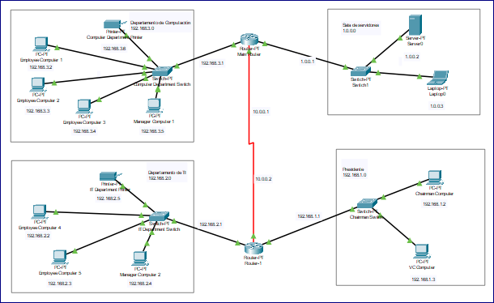

# Proyecto Seguridad en Redes ACA

Este repositorio contiene el desarrollo del **Proyecto de Aula** de la asignatura **Seguridad en Redes**, correspondiente al octavo semestre de Ingeniería de Sistemas en la **Corporación Unificada Nacional de Educación Superior (CUN)**.

El objetivo principal es **diseñar, implementar y documentar una red segura para una organización pequeña (Small Office / Home Office - SOHO)** utilizando **Cisco Packet Tracer**, aplicando conceptos de **segmentación de redes, VLANs, direccionamiento IP, enrutamiento y seguridad perimetral**.

---

## 🎯 Objetivos del Proyecto

1. **Diseñar la topología de red** para una oficina pequeña, simulando diferentes áreas (Dirección, TI, empleados).
2. **Configurar VLANs y direccionamiento IP** para garantizar segmentación y aislamiento entre departamentos.
3. **Aplicar medidas de seguridad** básicas en la red: contraseñas, banners, restricciones de acceso y control de dispositivos.
4. **Simular la conectividad entre equipos** y comprobar la comunicación segura entre las diferentes subredes.
5. **Documentar el proceso de configuración y resultados**, de manera que cualquier persona pueda replicar el escenario.

---

## 📂 Contenido del Repositorio

- `Proyecto_Seguridad_Redes_Final.pkt` → Archivo de simulación en **Cisco Packet Tracer** con toda la configuración realizada.
- `Proyecto de Aula ACA Seguridad en Redes V4.pdf` → Documento en formato PDF con la explicación detallada del proyecto (introducción, marco teórico, desarrollo y conclusiones).
- `README.md` → Este archivo de documentación.
- `ACA_Imagen.png` → Imagen representativa de la topología de red diseñada.

---

## 🛠️ Tecnologías y Herramientas

- **Cisco Packet Tracer** (simulación de la red).  
- **Git y GitHub** (control de versiones y documentación).  
- **Documentación académica** en formato PDF siguiendo normas APA.  

---

## 🌐 Topología de Red

A continuación, se incluye la imagen representativa de la red diseñada para el proyecto:

---

## 🚀 Resultados Esperados

- Validación de la conectividad entre dispositivos de diferentes VLANs.  
- Evidencia de segmentación y seguridad en el acceso a la red.  
- Documentación clara y ordenada del proceso de configuración.  
- Conclusiones sobre la importancia de aplicar **buenas prácticas de seguridad en redes** en entornos empresariales.  

---

## 👨‍💻 Autor

- Johann Esneider Casallas Becerra  
  *Estudiante de Ingeniería de Sistemas – CUN*  

---

## 📜 Licencia

Este proyecto fue desarrollado con fines **académicos** y está disponible bajo licencia MIT.  
Se permite su uso, modificación y distribución con fines educativos o de aprendizaje.
